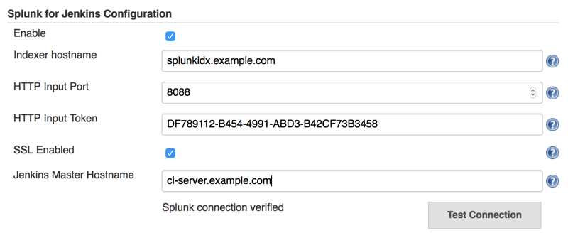
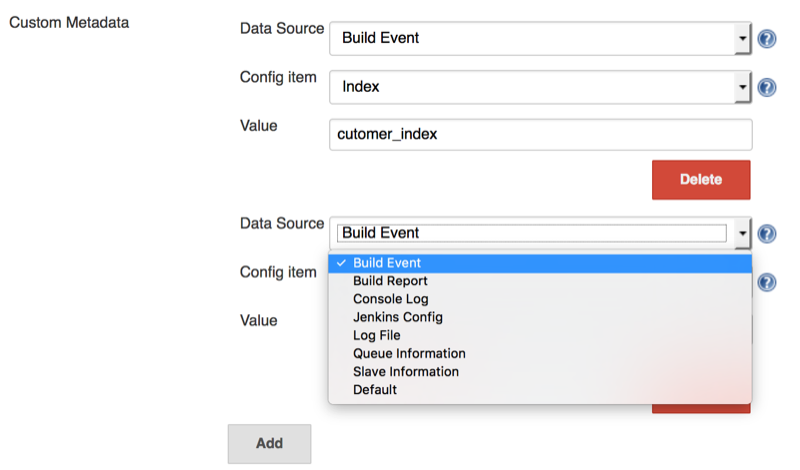

Splunk plugin for Jenkins provides deep insights into your Jenkins
master and node infrastructure, job and build details such as console
logs, status, artifacts, and an incredibly efficient way to analyze test
results.

  
The plugin is used together with a [Splunk App for
Jenkins](https://splunkbase.splunk.com/app/3332) that
provides out-of-the-box dashboards and search capabilities to enable
organizations to run a high performing Jenkins cluster and bring
operational intelligence into the software development life cycle.

## Splunk Plugin for Jenkins

### 1. Configure Splunk Server

-   Go to https://\<jenkins-url\>/configure
-   Enter Hostname, Port, and Token
    -   For Splunk cloud user, the host name is something like
        http-inputs-xx.splunkcloud.com or
        http-inputs-xx.cloud.splunk.com, port is 443
    -   For Splunk enterprise user, the host name is the indexer host
        name, and port is 8088 by default
-   Check "Raw Events Supported" if you are using Splunk version
    6.3.1511 or later
-   SSL is enabled by default in Splunk, it will protect the data
    transferred on network.
-   Click "Test Connection" to verify the setup
-   Check "Enable" and Save

    
    

### 2. Configure Metadata

Specify index, host, sourcetype for the various events. Metadata can be
configured to collect as little or as much Jenkins information as you
need and sent to Splunk for analysis. 

-   index is a data repository in Splunk, you can set a different data
    retention policy and access privileges for each index in Splunk. You
    need create the index in Splunk manually, the plugin will not create
    any index.
-   sourcetype is used by Splunk to determine how incoming data is
    formatted, see also [Why sourcetype
    matters](http://docs.splunk.com/Documentation/Splunk/6.4.3/Data/Whysourcetypesmatter)
-   host is used to identify which Jenkins master is the source of the
    data

There are 7 types of events which can be customized

|Event type|Description|
|---|---|
|*Build Report* |Junit or other Reports sent by calling "send(message)" DSL script|
|*Build Event* |Sent when job are started and completed|
|*Queue Information* |Basic queue information and Jenkins health metrics, sent when queue get updated and every 45 seconds by default. You can add "-Dcom.splunk.splunkjenkins.queueMonitorSeconds=N" to Jenkins start parameters to adjust the timing|
|*Console Log* |Build console log, e.g. job/abc/123/console, node log and Jenkins master log (jenkins.log)|
|*Log File* |Artifact contents, send by calling "archive(includes)" DSL script|
|*Slave Information* |The slave(agent) health metrics, sent every 8 minutes by default. You can add "-Dcom.splunk.splunkjenkins.slaveMonitorMinutes=N" to Jenkins start parameters to adjust the timing|
|*Jenkins Config* |The contents of Jenkins configuration items, e.g. config.xml, sent when the config file get updated.|

you can customize the index, sourcetype in the "Custom Metadata" section.



#### 2.1. Metadata configuration for [Splunk App for Jenkins](https://splunkbase.splunk.com/app/3332)

-   For Splunk version 6.5 or later, it is recommended to use the
    plugin's default config
-   For Splunk 6.3.x or 6.4.x, please adjust the default sourcetype to
    `json:jenkins:old` (please remove it if Splunk get upgraded to latest
    version, otherwise data will be extracted twice)


### 3. Customize The Job Data Sent to Splunk

In the **Advanced** configuration section, you can customize the post
data using groovy DSL.   
While the default settings should suffice for most Jenkins users, the
Advanced configuration section allows you to use groovy DSL to customize
the data sent to Splunk.

The groovy script can use the variable ***splunkins***, which provides
access to the following objects and methods:

-   `send(Object message)` will send the information to splunk
-   `getBuildEvent()` will return metadata about the build, such as
    build result, build URL, user who triggered the build
-   `getJunitReport(int pageSize)` will return a list of test results,
    which contains total, passes, failures, skips, time and testcase of
    type List\<hudson.tasks.junit.CaseResult\>
-   `getJunitReport(int pageSize, List<String> ignoredTestResultActions)` will
    return a list of test results except test formats specified in
    ignoredTestResultActions
-   `sendCoverageReport(pageSize)` send coverage, each event contains
    max pageSize metrics
-   `getJunitReport()` is an alias of
    `getJunitReport(Integer.MAX_VALUE)`
-   `archive(String includes, String excludes, boolean uploadFromSlave, String fileSizeLimit)`
    send log file to splunk
-   `archive(String includes)` is an alias of
    `archive(includes, null, false, "")`
-   `getAction(Class type)` is an alias of `build.getAction(type)`
-   `getActionByClassName(String className)` same as
    `getAction(Class type)` but no need to import the class before use
-   `hasPublisherName(String className)` check whether the publisher is
    configured for the build (applied to AbstractBuild only)
-   Here is the default settings for post job data processing (since
    v.1.5.0)

``` syntaxhighlighter-pre
//send job metadata and junit reports with page size set to 50 (each event contains max 50 test cases)
splunkins.sendTestReport(50)
//send coverage, each event contains max 50 class metrics
splunkins.sendCoverageReport(50)
//send all logs from workspace to splunk, with each file size limits to 10MB
splunkins.archive("**/*.log", null, false, "10MB")
```

#### 4. Customize log files at job level (optional)

Jenkins builds can produce many artifacts which can contain useful build
information. The plugin can be configured globally (step \#3) to collect
all artifacts using the archive command. You can also specify what
artifacts to send to Splunk at the job level by adding Splunk's
post-build action 'Send data to Splunk'

-   Add a "post-build action" called "Send data to Splunk"
-   Enter an ant-style pattern matching string for your junit xml
    collection


#### 5. Features Controlled with System Properties (optional)

System properties are defined by passing -Dproperty=value to the java
command line to start Jenkins. Make sure to pass all of these arguments
before the -jar argument, otherwise they will be ignored.
Example: `java -Dsplunkins.buffer=4096 -jar jenkins.war`

|Property|Default Value|Note|
|-------------|-------------|-------------|
|com.splunk.splunkjenkins.JdkSplunkLogHandler.level|INFO|log message levels lower than this will not be send to splunk|
|splunkins.buffer|4096|console log buffer size|
|splunkins.consoleLogFilterPattern|(empty)| regular expression for 'interesting' build. if it is set, only send console log to splunk for the job whose build url matches the pattern|
|splunkins.debugLogBatchSize|128|batch size for sending verbose level (FINE,FINER,FINEST) log record|
|splunkins.ignoreConfigChangePattern|(queue\|nodeMonitors\|UpdateCenter\|global-build-stats\|fingerprint\|build)(.*?xml)|regular expression for ignoring config file changes|
|splunkins.verifySSL|false|enable ssl certificate verification for splunk endpoint|
|splunkins.junitStdioLimit|2097152|trim long junit standard output/error, set it to 0 for unlimited|
  
------------------------------------------------------------------------

## Splunk Dashboards for Jenkins

You can download and install the Splunk App for Jenkins from
<https://splunkbase.splunk.com/app/3332>

Once installed, the Splunk App will use the data being sent by the
Splunk plugin for Jenkins and show various dashboards and search
capabilities. Here are some of the key features

**Overview** - Visualize multiple masters and associated slaves in a
single page. View build status trends and be able to drill down and get
details information about any build.

**Build Analysis** - Easily find any Jenkins build using a variety of
easy to use filters. View build summary or drill down to see build
status trends, build time and queue time analysis, tests pass/fail
trends, test runtime distribution, and console logs couple with Splunk's
powerful search interface.

**Test Analysis** - If you are a test engineer and spend countless hours
looking at test results in Jenkins, you will love this feature. Test
Results shows all the failing tests with stack traces, flags regression
failures, groups test failures by errors, captures Jenkin's environment
variables, and provides nifty filters to find tests with long run times,
particular errors, testsuites, etc.

**Jenkins Health** - Splunk Jenkins Apps captures Jenkins internal JVM
information as well as keys metrics like queue size, executors and
nodes stats, Jenkins master logs, and Jenkins node stats. All this
information is captured in real-time, allowing you to quickly discover
hard to find issues and fix them before they become a bottleneck for
development teams. No more ssh-ing into Jenkins systems to find issues.

**Jenkins Nodes** - Analyze all activity on a particular node. View
builds executed on a node, view real-time node logs, build activity
across all nodes, and check connection history to find out unstable
Jenkins nodes. This feature is extremely helpful in identifying
problematic components in a Jenkins cluster and optimizing your team's
throughput.

**Audit Trail** - Audit trail feature allows you to see who has logged
into your Jenkins system and done any activity like
starting/aborting/changing jobs. You can also see what configs have been
changed by some user and can view the config xml directly in Splunk.
This feature is particularly useful for organization with security and
compliance use cases. 

Screenshots


## Docker Demo Image

``` syntaxhighlighter-pre
curl -s -L https://raw.githubusercontent.com/fengxx/docker-splunk-app-jenkins/master/demo.sh | sh
```

## FAQ

### How can I send historical data prior to the time plugin get installed

Access \<jenkins\_url\>/script, and execute the groovy code (update the
time range if needed).

``` syntaxhighlighter-pre
def dataParser=new java.text.SimpleDateFormat("yyyy-MMM-dd HH:mm")
def startTime=0
def endTime=dataParser.parse("2016-OCT-26 13:24").getTime()
def archiver=new com.splunk.splunkjenkins.utils.BuildInfoArchiver()
archiver.run(startTime, endTime)
```

### I got "Server is busy, maybe caused by blocked queue", what can I do

Please try below options

a\) Adjust splunk queue size to a larger value, such as 5MB.
Edit SPLUNK\_HOME/etc/system/local/server.conf and add

``` syntaxhighlighter-pre
[queue]
maxSize = 5MB
```

b\) Adjust console text/log file buffer size, such as 10KB, Add below
line to Jenkins startup script

``` syntaxhighlighter-pre
-Dsplunkins.buffer=10240
```

### I am using upstream/downstream jobs, how can I consolidate the test results to root trigger job?

You can use "Customize Event Processing Script" 

  Click here to expand...

``` syntaxhighlighter-pre
/**
 * Transform job metadata before sending to splunk
 * This script is configured in Jenkins->Configure System->Splunk for Jenkins Configuration->Advanced
 *  ->Customize Event Processing Command
 */


import groovy.json.JsonSlurperClassic
import hudson.model.*
import com.splunk.splunkjenkins.model.CoverageMetricsAdapter
import com.splunk.splunkjenkins.utils.LogEventHelper
import org.apache.commons.codec.digest.DigestUtils

/**
 * @param run Jenkins job Run
 * @return the upstream job url and build number
 */
def getUpStreamBuild(Run build) {
    for (CauseAction action : build.getActions(CauseAction.class)) {
        Cause.UpstreamCause upstreamCause = action.findCause(Cause.UpstreamCause.class)
        if (upstreamCause != null) {
            return [upstreamCause.upstreamUrl, upstreamCause.upstreamBuild, upstreamCause.upstreamProject]
        }
    }
    return [build.parent.url, build.number, build.parent.fullName]
}

def isRebuild(String cause) {
    return cause?.contains("Rebuilds build")
}


def sendReport() {
    //junit report with page size set to 50, each page has maximum 50 test cases.
    //need ignore AggregatedTestResultAction since we already send downstream results
    def junitResults = splunkins.getJunitReport(50, ["hudson.tasks.test.AggregatedTestResultAction"])
    if (!junitResults) {
        return
    }

    def build = splunkins.build
    def metadata = LogEventHelper.getBuildVariables(build)
    def upStream = getUpStreamBuild(build)
    def buildEnv = LogEventHelper.getEnvironment(build)

    metadata["root_trigger"] = upStream[0]
    metadata["root_trigger_build_no"] = upStream[1]
    def causes = LogEventHelper.getBuildCauses(build)
    def rebuildFlag = isRebuild(causes)
    //end of metadata
    def event = [
            "job_url"      : upStream[0],
            "event_tag"    : "tests",
            "metadata"     : metadata,
            "build_number" : upStream[1],
            "user"         : LogEventHelper.getTriggerUserName(build),
            "job_name"     : upStream[2],
            "original_link": build.url,
            "rebuild"      : rebuildFlag,
            "trigger_by"   : causes
    ]

    if (junitResults && junitResults[0]["total"] > 0) {
        junitResults.eachWithIndex { junitResult, idx ->
            Map pagedEvent = event + ["testsuite": junitResult, "page_num": idx + 1]
            splunkins.send(pagedEvent)
        }
    } else {
        //test result not found
        def noResultEvent = event + ["event_tag": "no-tests", "page_num": 1]
        splunkins.send(noResultEvent)
    }
    def coverageList = CoverageMetricsAdapter.getReport(build, 200);
    //send code coverage
    event["event_tag"] = "coverage"
    coverageList.eachWithIndex { coverage, idx ->
        Map pagedEvent = event + ["coverage": coverage, "page_num": idx + 1]
        splunkins.send(pagedEvent)
    }
}

sendReport()

```

## Change Log
Located in the [CHANGELOG.md](CHANGELOG.md)