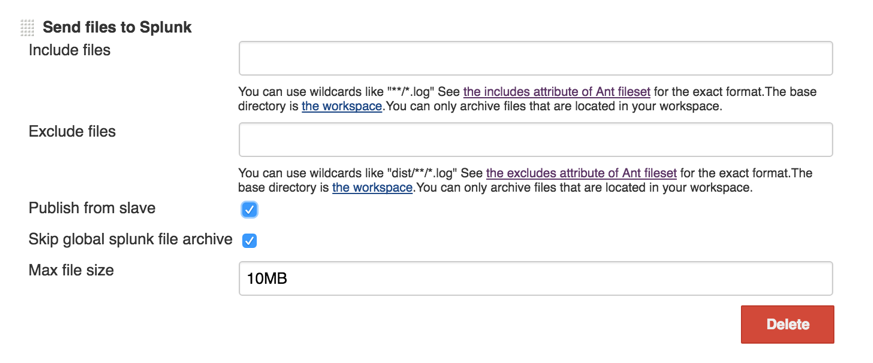

Splunk for Jenkins
---------

To Install Develop Version
----
 - clone the repo
 - `$ mvn package`
 -  That will generate `splunk-devops/target/splunk-devops.hpi` which you can install into Jenkins by the web interface or just put it in the `JENKINS_HOME/plugins` folder.
 - `$ mvn clean verify -Dhost=localhost -Dusername=admin -Dpassword=changeme`
   to run tests against local splunk instance


To Setup
----
### Configure plugin

 - Go to https://jenkins-url/configure
 - Enter Hostname, Port, and Token
 - Enable RawEvent support if you are using Splunk version 6.3.1511 or later
 - Click "Test Connection" to verify the config
 - Enable it and Save
 
   

### Customize Job Data Sent to Splunk

#### Customize post job processing

- In the advance configure section, you can customize the post data using groovy DSL
- ``send(Object message)`` will send the information to splunk
- ``AbstractBuild build``, ``Map env`` can be used directly. Variable env is a Map of Environment variables, build is hudson.model.AbstractBuild
- `getBuildEvent()` will return metadata about the build, such as build result, build URL, user who triggered the build
- `getJunitReport(int pageSize)` will return a list of test results, which contains total, passes, failures, skips, time and testcase of type List<hudson.tasks.junit.CaseResult>
- `getJunitReport()` is an alias of `getJunitReport(Integer.MAX_VALUE)[0]`
- sendCoverageReport(pageSize)  send coverage report, with pagination support
- sendTestReport(pageSize)  send Test report, with pagination support
- `archive(String includes, String excludes, boolean uploadFromSlave, String fileSizeLimit)` send log file to splunk
- `archive(String includes)` is an alias of `archive(includes, null, false, "")`
- `getAction(Class type)` is an alias of ` build.getAction(type)`
- `getActionByClassName(String className)` same as `getAction(Class type)` but no need to import the class before use
- `hasPublisherName(String className)` check whether the publisher is configured for the build (applied to AbstractBuild only)
- Here is the default settings for post job data processing

```groovy
//send job metadata and junit reports with page size set to 50 (each event contains max 50 test cases)
splunkins.sendTestReport(50)
//send coverage, each event contains max 50 class metrics
splunkins.sendCoverageReport(50)
//send all logs from workspace to splunk, with each file size limits to 10MB
splunkins.archive("**/*.log", null, false, "10MB")

```

#### Customize log files at job level
- Add a "post-build action" called "Send data to Splunk"
- Enter an ant-style pattern matching string for your junit xml collection

  
 
Dashboard
----

you can get the "Splunk App for Jenkins" App from [splunk base](https://splunkbase.splunk.com/app/3332/)


System Requirement
-----
You need enable "HTTP Event Collector" In Splunk to use the plugin,
please checkout [HTTP Event Collector](http://dev.splunk.com/view/event-collector/SP-CAAAE7G)


Features Controlled with System Properties
----

System properties are defined by passing -Dproperty=value to the java command line to start Jenkins. Make sure to pass all of these arguments before the -jar argument, otherwise they will be ignored. Example:

`java -Dsplunkins.buffer=4096 -jar jenkins.war`


|Property|Default Value|Note|
|-------------|-------------|-------------|
|com.splunk.splunkjenkins.JdkSplunkLogHandler.level|INFO|log message levels lower than this will not be send to splunk|
|splunkins.buffer|4096|console log buffer size|
|splunkins.consoleLogFilterPattern|(empty)| regular expression for 'interesting' build. if it is set, only send console log to splunk for the job whose build url matches the pattern|
|splunkins.debugLogBatchSize|128|batch size for sending verbose level (FINE,FINER,FINEST) log record|
|splunkins.ignoreConfigChangePattern|(queue\|nodeMonitors\|UpdateCenter\|global-build-stats\|fingerprint\|build)(.*?xml)|regular expression for ignoring config file changes|
|splunkins.verifySSL|false|enable ssl certificate verification for splunk endpoint|
|splunkins.junitStdioLimit|2097152|trim long junit standard output/error, set it to 0 for unlimited|
